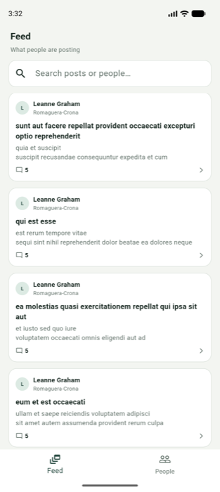
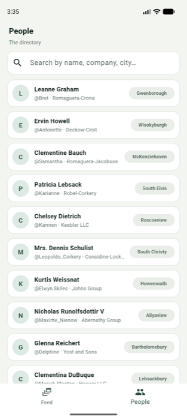
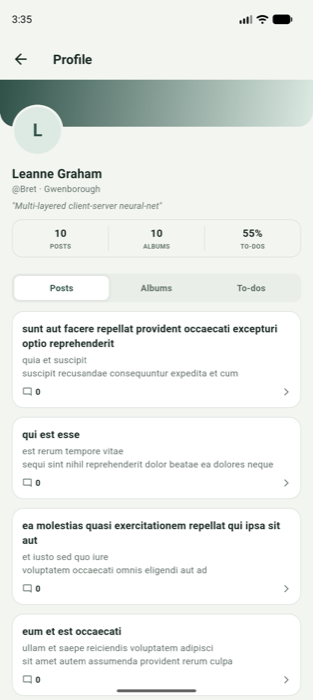
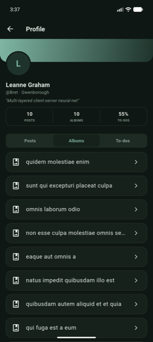
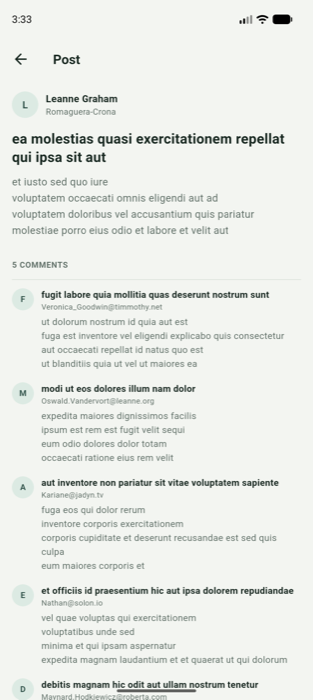
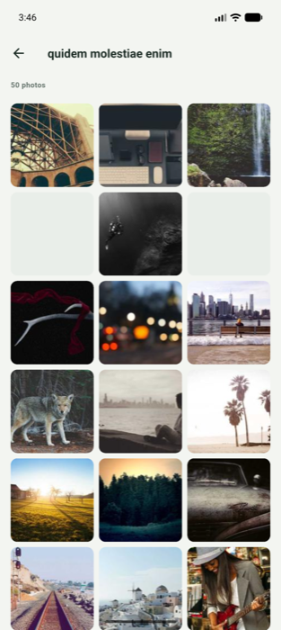

# Commons

A social directory app built with Flutter — browse a feed of posts, explore a
people directory, and drill into rich profiles with albums, photos, and
to-dos. Built as a clean-architecture playground on top of the
[JSONPlaceholder](https://jsonplaceholder.typicode.com/) API.

<p align="center">
  
  
  
  
</p>

## Features

- **Feed** — every post across all users, with live client-side search over
  title, body, and author name, plus per-post comment counts.
- **People directory** — the full user list, searchable by name, company, or
  city.
- **Profile** — a per-user page with a gradient header, stat counters
  (posts / albums / to-do completion), and tabbed **Posts / Albums / To-dos**
  sections, with a filter for active vs. completed to-dos.
- **Post detail** — full post body with its comment thread.
- **Albums & photo viewer** — an album's photo grid opens into a full-screen,
  swipeable photo viewer.
- **Light & dark themes** — a custom moss-green / clay-orange design system
  that follows the system theme.
- **Splash screen** — branded launch screen before landing on the feed.

## Screens

| Feed | People | Post detail | Album |
|---|---|---|---|
|  |  |  |  |

## Architecture

Feature-first structure, kept intentionally simple — no state management
library, no DI framework, just `Future`/`FutureBuilder` and a thin API layer.

```
lib/
├── core/
│   ├── network/     # Endpoints + a tiny http-based API client
│   ├── router/       # GoRouter config (bottom-nav shell + drill-in routes)
│   ├── theme/         # Design tokens (AppColors) and light/dark ThemeData
│   └── widgets/       # Shared UI: PostCard, InitialsAvatar, AppLoader, AppError…
└── features/
    ├── feed/          # Global posts feed
    ├── users/          # People directory
    ├── profile/        # User profile, posts, albums, photo viewer, todos
    └── splash/         # Launch screen
```

**Navigation** is a [`go_router`](https://pub.dev/packages/go_router)
`StatefulShellRoute` with two persistent tabs (Feed, People); Profile, Post,
Album, and the photo viewer are pushed on top and hide the bottom bar.

## Tech stack

- **Flutter** / Dart (SDK ^3.10.8)
- [`go_router`](https://pub.dev/packages/go_router) for declarative,
  type-safe navigation
- [`http`](https://pub.dev/packages/http) for networking
- [JSONPlaceholder](https://jsonplaceholder.typicode.com/) as a fake REST
  backend (users, posts, comments, albums, photos, todos)
- [picsum.photos](https://picsum.photos) for album/photo images — JSONPlaceholder's
  own photo URLs point at the now-defunct via.placeholder.com, so `PhotoModel`
  reseeds each photo's `id` against picsum instead

## Getting started

```bash
flutter pub get
flutter run
```

Requires Flutter 3.x+ with a configured Android/iOS toolchain. No API keys or
`.env` setup needed — the app talks directly to the public JSONPlaceholder API.

## Known limitations

- No offline caching or persistence layer yet — every screen fetches fresh
  on open.

## Roadmap

- Pull-to-refresh on the feed and profile
- Unit/widget test coverage
